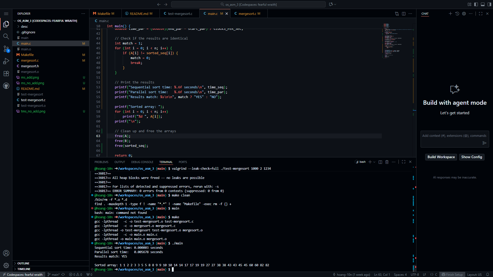
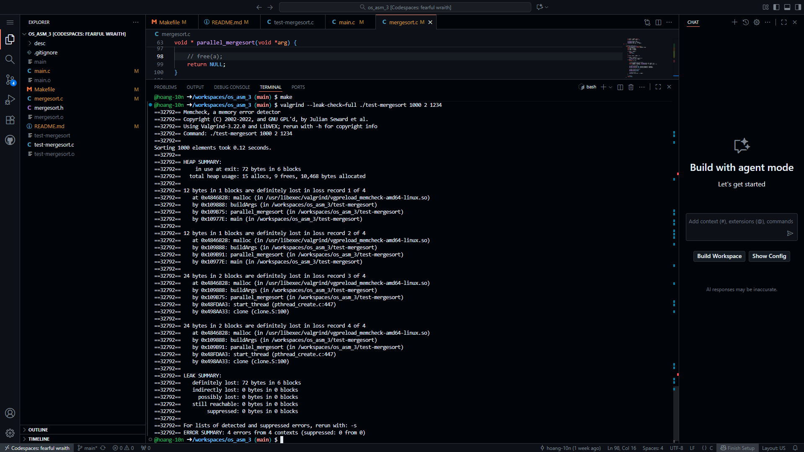
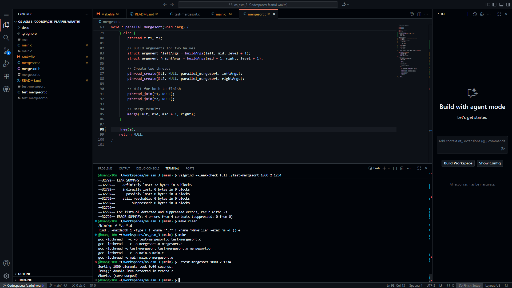
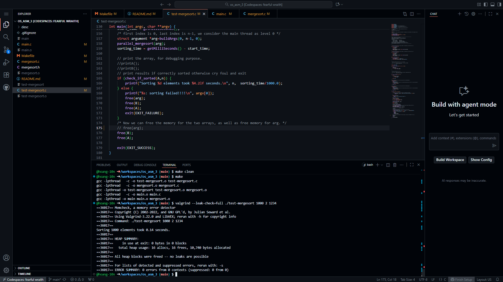

# Parallel Merge Sort

- **Author**: Luong Hoang Doan - a1960929

- **Group Name**: Luong Hoang Doan - a1960929

## Overview

This project implements a Parallel Merge Sort in C using POSIX threads (pthread).
The program demonstrates how divide-and-conquer algorithms such as merge sort can be parallelised using threads to achieve speedup on multi-core systems.

Here are all the requirements:

* Uses recursive thread creation to divide sorting tasks across multiple cores.
* Each recursive call creates up to two new threads until a user-specified cutoff level is reached.
* Once the cutoff level is reached, the algorithm falls back to sequential merge sort.
* Ensures correct synchronization, and avoids deadlocks, race conditions, memory leaks, and double frees.

## Manifest

The program defines four key functions (as specified in `mergesort.h`):

* `merge(int leftstart, int leftend, int rightstart, int rightend)`:
  Merges two sorted halves of the global array `A` into the auxiliary array `B`, then copies the merged data back.

* `my_mergesort(int left, int right)`:
  Performs the standard recursive merge sort using a single thread.

* `buildArgs(int left, int right, int level)`:
  Allocates and returns a struct containing the range indices and recursion depth for each thread.

* `parallel_mergesort(void *arg)`:
  The core parallel merge sort routine.
  It creates new threads for each half until `cutoff` is reached, then merges results.

## Building the Project

### Requirements

* GCC compiler
* POSIX Threads (pthread)
* Linux or macOS terminal (or WSL on Windows)
* Make (optional)

### Build Command

If you have `make`, you can run make commands

* To build the `test-mergesort` and `main` file, run:

```bash
make
```

**Notes**: make sure to clean the compiled files first before running compiling commands.

* To clean all the compiled files, run:

```bash
make clean
```

---

If you don't have `make`, run this in the project directory:

```bash
gcc -pthread mergesort.c test-mergesort.c -o test-mergesort
gcc -pthread mergesort.c main.c -o main
```

This creates executables named `test-mergesort` and `main`.


## Features and Usage

### Features

* Supports both sequential and parallel merge sort.
* Adjustable cutoff level to control thread creation depth.
* Automatically merges results after parallel execution.
* Designed to handle large input arrays efficiently.

### Usage

Run the executable with optional arguments:

```bash
./test-mergesort
```

or if modified to take parameters (like `test-mergesort`):

```bash
./test-mergesort <array_size> <cutoff_level> <random_seed>
```

Example:

```bash
./test-mergesort 1000000 2 1234
```

This sorts 1,000,000 randomly generated elements using parallel merge sort up to level 2.

To run all of the test scenarios with `test-mergesort`, run:

```bash
make multitest
```

To run the test file `main`, run:
```bash
./main
```

## Testing

* Verify correctness by comparing sequential and parallel outputs by running `main`.


* Use Valgrind to ensure no memory leaks or invalid frees:

  ```bash
  valgrind --leak-check=full ./test-mergesort 1000 2 1234
  ```


## Known Bugs

* For very small arrays (e.g., <1000 elements), the parallel version can be slower due to thread creation overhead.
* Performance gain plateaus around cutoff = 5–6 because of CPU core limits.
* When the cutoff value is too high, the code spawn too many threads for the CPU to handle effectively. The OS has to switch between threads, causing overhead. Context-switch overhead and Memory usage increases, Cache performance drops and Synchronisation overhead (e.g., pthread_join) becomes significant causing the runtime to increase again.
* Double free problem and data leak when applying free at improper place
    * If I apply free to the end of `parallel_mergesort()` function in `mergesort.c`, I got invalid free error because the `arg` in `test-mergesort.c` is freed twice.

    * If I don't apply free to the end of `parallel_mergesort()` function in `mergesort.c`, when I run `valgrind`, not all of the variables are freed, causing memory leak.

    * The right solution is to add the free in `mergesort.c` and remove the arg free `free(arg)` at the end of `test-mergesort.c`.


## Reflection and Self Assessment

I learned how pthread_create and pthread_join function to manage concurrency effectively. Along the way, I encountered some challenges with memory management, specifically issues like double freeing and minor memory leaks. I resolved these by making sure each thread was responsible for freeing only its own argument structure. This experience helped me gain a better understanding of thread synchronization and the principles of divide-and-conquer parallelism. One of the biggest challenges I faced was finding the right balance between the depth of parallelism and overall performance, as having too many threads could actually decrease efficiency. In the end, it was incredibly satisfying to see the significant speedup on large datasets after optimizing the cutoff points and merge operations.

## Sources Used

* Course materials (Conccurency and Parallelism)
* POSIX Threads documentation: https://man7.org/linux/man-pages/man7/pthreads.7.html
* GeeksForGeeks - Mergesort algorithm: https://www.geeksforgeeks.org/dsa/merge-sort/
* ChatGPT (for code explanation and debugging help)